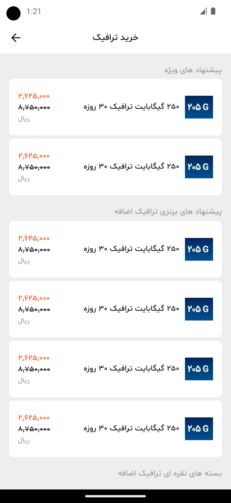
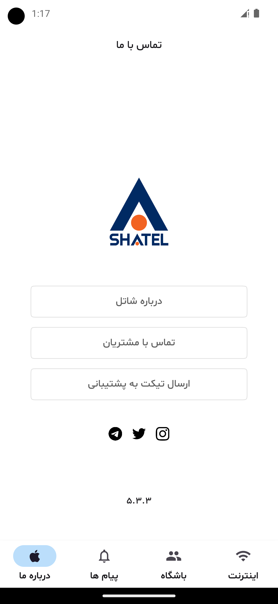
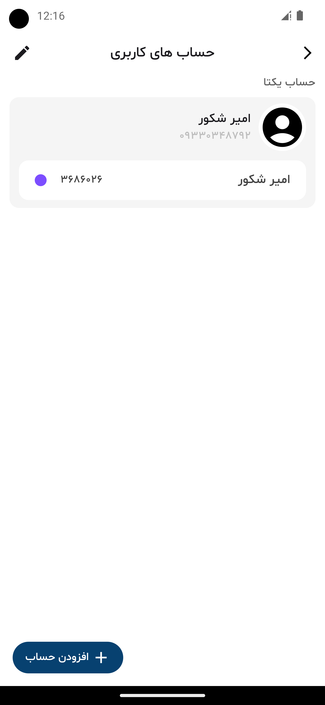
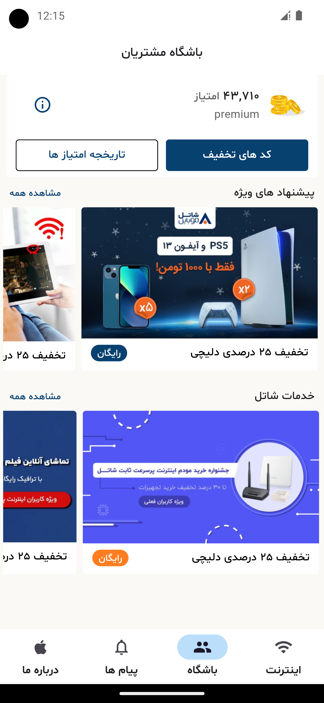
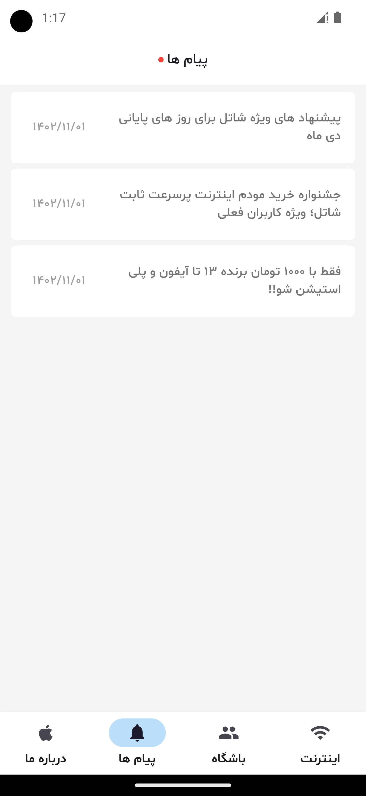
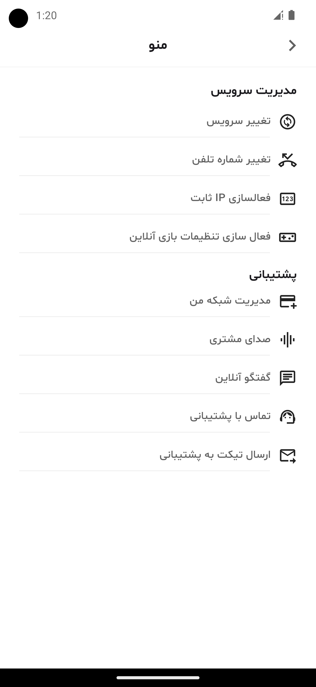
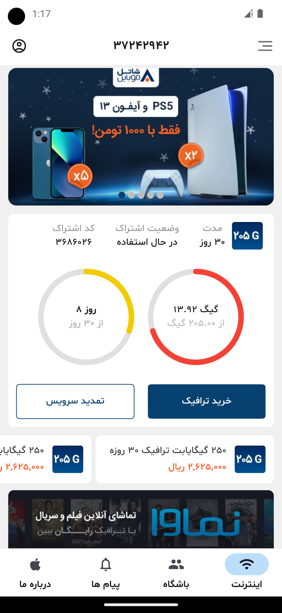

# Shatel Flutter Redesign 🚀

Shatel Flutter Redesign is an exciting mobile application concept built using the Flutter framework, aimed at revolutionizing the user experience of the Shatel internet service provider platform in Iran. With a focus on user-friendliness and visual appeal, this redesign offers users a modern, sleek, and engaging interface to manage their internet services seamlessly.

## Key Features 🌟

- **Intuitive Navigation:** Easily explore essential features through streamlined navigation pathways.
- **Elegant Design Language:** Enjoy a visually captivating interface crafted with a clean and modern design language.
- **Enhanced Functionality:** From account management to service exploration, every aspect of the Shatel experience is optimized for efficiency and user satisfaction.
- **Responsive Layout:** Experience seamless usability across devices and screen sizes with the platform's responsive design.
- **Personalization Options:** Tailor your experience by customizing settings, preferences, and notifications to your liking.

## Screenshots 📱

Here are some snapshots showcasing the redesigned platform:

- 
- 
- 
- 
- 
- 
- 

## Installation 🛠️

The Shatel Flutter Redesign application is currently a design concept and not publicly available. It was created to showcase design skills and as part of a portfolio or resume project. I'd like you to please stay tuned for updates on its development progress.

## Feedback and Collaboration 🤝

Your feedback and collaboration are invaluable to the success of the Shatel Flutter Redesign project. Whether you have insights, or suggestions, or would like to contribute to the design process, we welcome your input and collaboration.

## License 📝

This project is licensed under the [MIT License](LICENSE).

